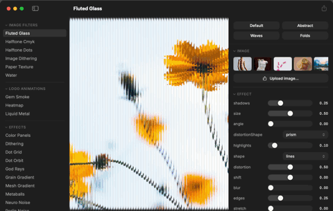
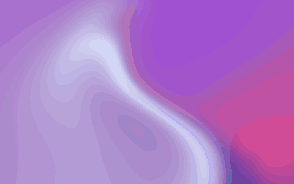

# PaperShadersMetal

Swift Package that renders the converted Metal shader artifacts from
`packages/shaders-metal/dist/` via `MTKView`, plus a minimal macOS preview
app (`PaperShadersPreview`) for verifying the conversion is pixel-correct
against the web reference.

Not a bun workspace member — the root `package.json` lists workspaces
explicitly, so this directory is inert to bun. Never add it to that list.



Eight of the 29 shaders, rendered by the same runtime:



## Install the preview app (no toolchain needed)

macOS 14+, universal binary, free/unsigned (ad-hoc signature):

```bash
curl -fsSL https://raw.githubusercontent.com/l0kyurue1/shaders/main/install.sh | bash
```

Rerun the same command to update. Uninstall:

```bash
curl -fsSL https://raw.githubusercontent.com/l0kyurue1/shaders/main/install.sh | bash -s -- --uninstall
```

Manual alternative: download `PaperShadersMetal-*.zip` from
[Releases](https://github.com/l0kyurue1/shaders/releases), unzip, drag the
app to Applications. Browser downloads get the quarantine xattr (curl does
not), so clear it once or Gatekeeper will refuse the unsigned app:

```bash
xattr -rd com.apple.quarantine "/Applications/Paper Shaders Metal.app"
```

Release engineering: `scripts/make-app-bundle.sh <version>` (repo root)
builds the universal .app + zip; pushing a `preview-v*` tag publishes it as
a GitHub Release via `.github/workflows/release-preview-app.yml`.

## Prerequisites

The Swift package consumes `.metal` + `manifest.json` build artifacts; it
does not vendor them. Build them first:

```bash
cd packages/shaders-metal && bun run build
```

`dist/` is gitignored — regenerate it in any fresh checkout or CI runner
before `swift build` / `swift test`.

## Commands

```bash
cd packages/shaders-metal-swift
swift build                    # library + preview app
swift test                     # unit tests; GPU-dependent cases self-skip
                                # via XCTSkipIf when no Metal device is present
swift run PaperShadersPreview  # launch the preview app
```

The preview app's toolbar has two export buttons for the selected shader:
**Copy Metal** copies the converted `.metal` fragment source
(`dist/<shader>.metal`) — the raw shader, ready to paste into an Xcode Metal
file. **Copy SwiftUI** copies a self-contained SwiftUI view that renders the
shader with the current parameter values baked in (spec §4.3 export; the same
snippet the MCP `export_snippet` tool emits).

`DistLocator` finds `dist/` by walking up from the package source; override
the location with the `PAPER_SHADERS_DIST` environment variable:

```bash
PAPER_SHADERS_DIST=/path/to/dist swift run PaperShadersPreview
```

## Session file protocol

`session/params.json` (gitignored) is a file-as-protocol contract for
driving the preview app externally — the future MCP server's integration
point. Write name-keyed params (the manifest vocabulary, not uniform names)
and the running app picks up the change within ~200 ms:

```json
{ "shader": "warp", "params": { "scale": 1.4, "shape": "stripes", "colors": ["#121212", "#9470ff"], "speed": 2 } }
```

Editing params in the app writes the same file back. Malformed JSON keeps
the last-good render and shows an error badge instead of crashing.

## Snapshot golden tests

`SnapshotTests` offscreen-renders all 29 shaders and tolerant-diffs each
against a committed golden PNG under
`Tests/PaperShadersMetalTests/__Snapshots__/`. They guard against
coordinate-origin flips (WebGL bottom-left vs Metal top-left) and semantic
drift in the shader conversion — either moves a large fraction of pixels by
large deltas, which the diff catches.

Fixed capture params (identical for goldens and asserts, never change one
without regenerating every golden): `FRAME = 1000` (1 s), `SIZE = 128×128`,
`pixelRatio = 1`, default manifest params only.

Regenerate the goldens (after a deliberate, reviewed shader change):

```bash
UPDATE_GOLDENS=1 swift test --filter Snapshot
```

The diff is tolerant, not exact, because GPU float precision differs across
machines (local bless vs CI runner). Two ceilings: `MAX_CHANNEL_DELTA = 4`
(per-channel 0–255) and `MAX_DIFF_FRACTION = 0.005` (≤0.5 % of pixels may
exceed the delta). Raise them only if a different CI GPU produces cross-GPU
jitter that trips the gate — a real Y-flip or drift still moves far more than
0.5 % of pixels. Goldens are committed to git (a regression contract, unlike
gitignored `dist/`); the baseline was blessed once by eye against the web
reference.

## Deferred (not in this package, yet)

Per-shader typed Swift API + codegen, precompiled `metallib` loading mode,
an iOS / macOS-11 floor (this package targets macOS 14 for
`MTLPipelineOption.bindingInfo` reflection and `@Observable`), and automated
perceptual-diff snapshots against the web reference.
